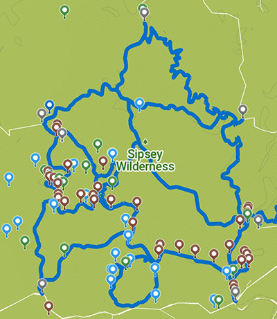

# Sipsey Wilderness (Alabama) Complete GPX Map for Hikers 

Sipsey Wilderness is a wilderness area within the Bankhead National Forest, with beautiful trails, campsites, boulders, creeks, rivers, and waterfalls. This is a comprehensive map of all waypoints (trailheads, waterfalls, campsites, boulders, attractions etc.) and tracks (from 200 to 224) formed by patching together public info I found online, info I gathered from my own trips, and using the OSM & GPXstudio.

There are three files:

`a_Sipsey_TrailTracks_Waypoints_combined.gpx` : This file includes all trail tracks and waypoints.
	
`b_Sipsey_TrailTracks.gpx` : This file includes only the trail tracks
	
`c_Sipsey_Waypoints.gpx`: This file includes only the waypoints.

In most situations, you would want to use (a). <a href="https://gpx.studio/#?state=%7B%22urls%22%3A%5B%22https%3A%2F%2Fraw.githubusercontent.com%2Ffiratsoylu%2Fsipsey_wilderness_gpx%2Fmain%2Fa_Sipsey_TrailTracks_Waypoints_combined.gpx%22%5D%7D" target="_blank">You can explore the map here on GPXStudio (click on the "App" button)</a>

You can use the GPX map with any hiking app that allows GPX imports. I prefer to use the free & open source Comaps app. Below is how the map looks in GPXstudio:

Below is how it looks in the Comaps. In the GPX file, I included specific color coding information (unique to Comaps) for different waypoints: 
- brown: campsites  
- blue: falls & water sources  
- green: attractions (boulders etc.),  
- gray: parking/trailheads

For other apps, information for the waypoints were included as symbols (so that you can see a camp symbol for campsites etc.)

Please use the map with caution. I tried my best to get the most accurate information, but there might be inaccurate information on the map. Use it at your own risk. I will be updating it after each trip, and will post the most up-to-date version. 
